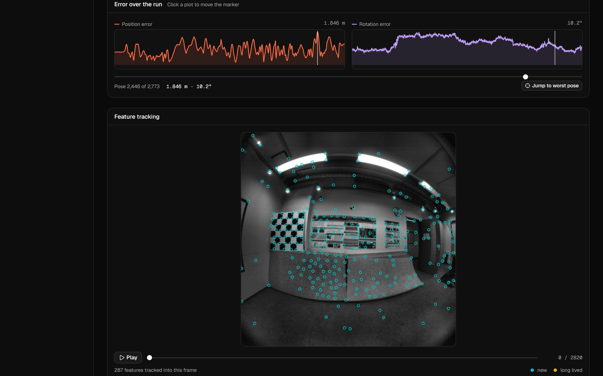
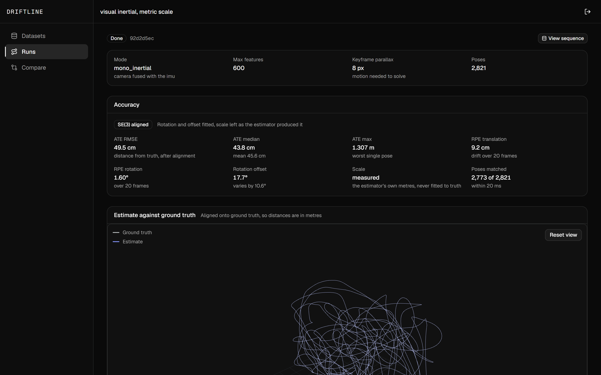
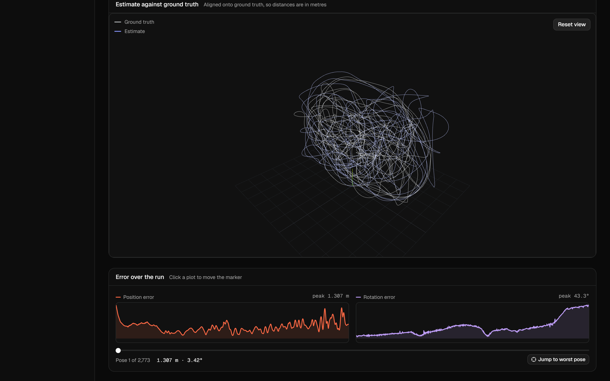
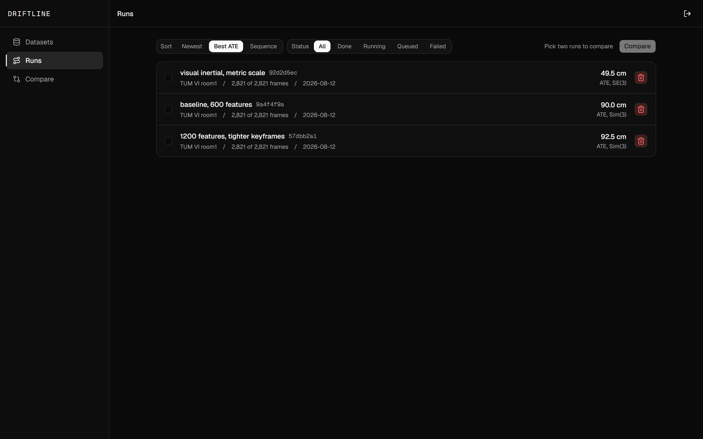
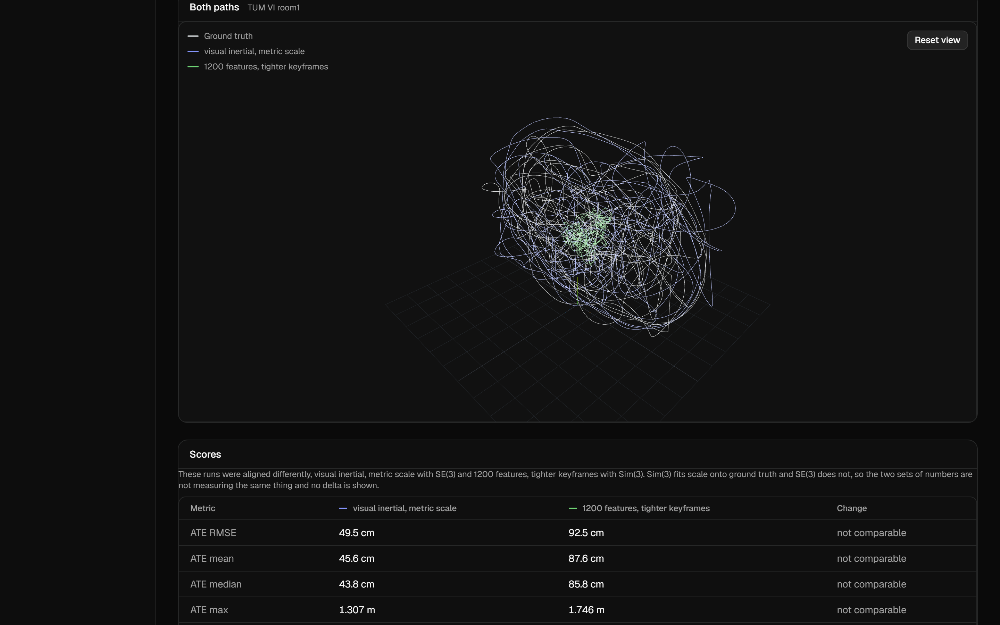
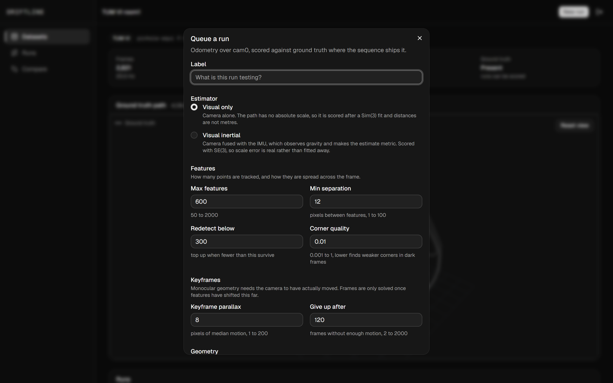

# driftline

> Estimate a camera's trajectory from video and IMU, then measure exactly where it drifts away from ground truth.

<p align="center">
  
  
  
  
</p>

<p align="center">
  
</p>

Point it at a recorded sequence. It tracks features through the images, solves the camera motion, optionally fuses the IMU to recover metric scale, and scores the result against hardware-measured ground truth. The trajectory viewer overlays estimate on truth and the inspector holds the frame where a run went wrong, so a parameter change is judged by its effect on drift rather than by eye.

Every figure below comes from one real sequence, TUM VI room1: 2,821 frames of a handheld 512x512 fisheye camera walking a 146 m loop around a room, with 28,122 IMU samples and mocap ground truth.

## What the IMU buys you

The same estimator over the same 2,821 frames, twice. The difference is one config field.

| Run | ATE RMSE | Alignment | Scale |
| --- | --- | --- | --- |
| Camera only | 90.0 cm | Sim(3) | fitted onto truth before scoring |
| Camera and IMU | **49.5 cm** | SE(3) | measured by the IMU, never fitted |

Twice as accurate, and it earns the number under a stricter alignment. A monocular camera cannot observe scale, so its estimate is stretched onto ground truth by the scoring before an error is computed. The IMU observes gravity, which makes the estimate metric, so it is scored with rotation and offset only and its scale error is real rather than fitted away.

<p align="center">
  
</p>

That distinction is carried everywhere rather than hidden. A run states the alignment it was scored under next to its ATE, and two runs aligned differently will not be given a delta.

## Features

**Drift you can see, not just a number.** The estimate and ground truth are drawn in one frame after alignment, over a grid sized to the path. A scrubber moves a marker along both together.

<p align="center">
  
</p>

**The frame where it went wrong.** Position and rotation error are plotted against the run, and clicking either moves the marker, the slider and the 3D view together. The source frame at that pose is drawn with its tracked features, which is what shows *why* a run drifted: features dying on a blank wall, or all clustering in one corner.

**Runs ranked by accuracy, across every sequence.** Sorting and filtering happen in the database rather than on the page that arrived, so the ordering is real on a paginated list. A run that was never scored reads "not scored" instead of zero, which would sort as the best run.

<p align="center">
  
</p>

**Comparison that refuses to mislead you.** Two runs go side by side with the config diff, both paths in one viewer, and a metrics table. When the two were aligned differently the delta column is withheld and the reason is stated, because the difference between a Sim(3) figure and an SE(3) one measures the alignment rather than the estimator.

<p align="center">
  
</p>

**Every estimator field, with its range and what it does.** The run dialog names what each parameter costs rather than presenting a wall of numbers, and validates client side against the same bounds the server enforces.

<p align="center">
  
</p>

## How a run works

1. A sequence is registered by path. The reader inspects the folder to decide its source, frame count and whether ground truth exists. None of that is user supplied.
2. A run is queued with a validated config and returns immediately. Long work never happens in the request.
3. The worker claims the oldest queued run with a skip-locked row lock, so two workers never take the same one, and tracks features frame to frame.
4. Frames become keyframes once the features have shifted far enough, because monocular geometry needs the camera to have actually moved.
5. The essential matrix is decomposed and all four candidate poses are scored, rather than trusting the first one that passes a chirality check.
6. For an inertial run the IMU is preintegrated between keyframes and fused with the visual directions, which fixes the scale the camera alone cannot see.
7. The estimate is aligned onto ground truth, Sim(3) for monocular and SE(3) for inertial, then ATE and RPE are computed and stored with the alignment used.

## Tech

| Layer | Choice |
| --- | --- |
| Backend | FastAPI on Python 3.13. Owns the API, the reader, the estimator and the scoring |
| Worker | A thread inside the API that polls for queued runs. One run at a time, claimed with a row lock |
| Vision | OpenCV 5 for tracking and two view geometry |
| Fusion | GTSAM for IMU preintegration and the factor graph |
| Scoring | ATE and RPE implemented against NumPy and SciPy, with evo as the oracle the tests check them against |
| Database | PostgreSQL with SQLAlchemy and Alembic |
| Frontend | Next.js and React. Three.js for the trajectory viewer, no business logic |
| Testing | pytest with Hypothesis for the geometry invariants, Vitest and Playwright for the UI |

An inertial run that cannot reach GTSAM fails rather than falling back to the camera-only path, because a unit-scale estimate scored as though it were metric reads as a catastrophic error rather than a missing dependency.

## Requirements

- Python 3.13+ and Node 20+
- PostgreSQL 16+
- Docker, which is where inertial runs execute

## Running locally

Start the database:

```bash
docker compose up -d
```

Backend, from `backend/`. Activate the virtualenv first, then:

```bash
pip install -r requirements-dev.txt
cp .env.example .env
alembic upgrade head
uvicorn main:app --app-dir src --reload
```

Frontend, from `frontend/`:

```bash
npm install
cp .env.example .env.local
npm run dev
```

The app runs at `http://localhost:3000` and the API at `http://localhost:8000`.

Inertial runs execute in a container. Build it once:

```bash
docker build -t driftline-fusion backend
```

## Sequences

driftline reads the ASL folder layout, which TUM VI and EuRoC both use. Download one, extract it into `data/`, and register the folder holding `mav0`:

```
https://cdn3.vision.in.tum.de/tumvi/exported/euroc/512_16/dataset-room1_512_16.tar
```

The `room` sequences carry ground truth for the full trajectory, so estimates run against them can be scored. Sequences are read in place and never copied into the database.

## Tests

```bash
pytest
npm test && npm run e2e
```

Tests needing a real sequence read `data/dataset-room1_512_16` and skip when it is absent. Point them elsewhere with `DRIFTLINE_TEST_SEQUENCE` (backend) or `E2E_SEQUENCE_PATH` (end to end).

The geometry tests check invariants with Hypothesis and cross-check the metrics against evo, so a scoring change that agrees with itself but disagrees with the reference implementation fails.
